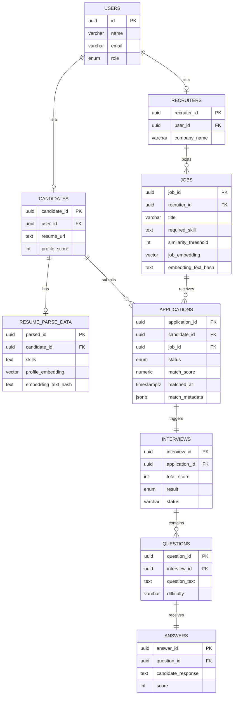

# Database Architecture & Schema

## A. Overview
The database for the AI-Based Candidate Recruitment System serves as the central hub for storing user profiles, job postings, candidate applications, and AI-driven interview assessments. 

We use **Supabase (PostgreSQL)** because of its powerful relational features, built-in vector support (`pgvector`) for AI matching, and out-of-the-box authentication integration. Supabase provides real-time capabilities and seamless integration with our React frontend and Node.js backend, allowing for secure and scalable data flow.

---

## B. Schema Design

### 1. `users`
Core table for authentication and role management.
- `id` (UUID, Primary Key) - References `auth.users.id`.
- `name` (VARCHAR) - Full name of the user.
- `email` (VARCHAR, Unique) - User's email address.
- `role` (ENUM: 'candidate', 'recruiter') - Role of the user in the platform.
- `created_at` (TIMESTAMPTZ) - Account creation timestamp.

### 2. `candidates`
Stores candidate-specific profile details.
- `candidate_id` (UUID, Primary Key)
- `user_id` (UUID, Unique, Foreign Key `users.id`)
- `resume_url` (TEXT) - Link to candidate's uploaded resume.
- `profile_score` (INT) - Overall AI-computed profile score.
- `created_at` (TIMESTAMPTZ)

### 3. `recruiters`
Stores recruiter-specific profile details.
- `recruiter_id` (UUID, Primary Key)
- `user_id` (UUID, Unique, Foreign Key `users.id`)
- `company_name` (VARCHAR) - Company the recruiter represents.
- `created_at` (TIMESTAMPTZ)

### 4. `jobs`
Job postings created by recruiters.
- `job_id` (UUID, Primary Key)
- `recruiter_id` (UUID, Foreign Key `recruiters.recruiter_id`)
- `title` (VARCHAR) - Job title.
- `description` (TEXT) - Detailed job description.
- `required_skill` (TEXT) - Expected skills (JSON or comma-separated).
- `experience_level` (VARCHAR) - Entry, Mid, Senior.
- `location` (VARCHAR) - Job location.
- `qualification` (VARCHAR) - Minimum education/qualification.
- `positions` (INT) - Number of open roles.
- `interview_difficulty` (VARCHAR) - Difficulty level for AI questions.
- `passing_threshold` (INT) - Score needed to pass the AI interview.
- `similarity_threshold` (INT, DEFAULT 60) - **[AI Matching]** Minimum cosine similarity percentage (0–100) required for a candidate to be auto-selected for interview. Set by the recruiter during job creation.
- `job_embedding` (VECTOR(384)) - **[AI Matching]** Dense vector embedding of the job description, generated via HuggingFace `BAAI/bge-small-en-v1.5`. Used for cosine similarity matching against candidate profiles.
- `embedding_text_hash` (TEXT) - **[AI Matching]** MD5 hash of the text used to generate `job_embedding`. Used to avoid re-generating embeddings when the job description hasn't changed.
- `created_at` (TIMESTAMPTZ)

**Constraints:**
- `chk_similarity_threshold`: `similarity_threshold >= 0 AND similarity_threshold <= 100`

### 5. `applications`
Links candidates to the jobs they applied for. Now includes AI matching results.
- `application_id` (UUID, Primary Key)
- `candidate_id` (UUID, Foreign Key `candidates.candidate_id`)
- `job_id` (UUID, Foreign Key `jobs.job_id`)
- `status` (ENUM: 'pending', 'selected_for_interview', 'interviewing', 'accepted', 'rejected', 'under_review') - Application progression. The `selected_for_interview` and `rejected` values are set automatically by the AI matching engine.
- `match_score` (NUMERIC(5,2)) - **[AI Matching]** Cosine similarity percentage between candidate profile and job description (0.00–100.00).
- `matched_at` (TIMESTAMPTZ) - **[AI Matching]** Timestamp when the AI matching was computed.
- `match_metadata` (JSONB) - **[AI Matching]** Metadata about the matching process (model name, dimensions, threshold applied, processing time).
- `created_at` (TIMESTAMPTZ)

**Constraints:**
- `chk_match_score`: `match_score IS NULL OR (match_score >= 0 AND match_score <= 100)`

### 6. `interviews`
Tracks the AI-driven interview instances per application.
- `interview_id` (UUID, Primary Key)
- `application_id` (UUID, Unique, Foreign Key `applications.application_id`)
- `interview_date` (TIMESTAMPTZ) - When the interview is scheduled/taken.
- `status` (ENUM: 'not_started', 'in_progress', 'completed', 'abandoned')
- `total_score` (INT) - Aggregated score from answers.
- `result` (ENUM: 'pass', 'fail', 'pending') - Final interview outcome.
- `current_difficulty_level` (VARCHAR) - Adaptive difficulty state.
- `created_at` (TIMESTAMPTZ)

### 7. `questions`
Dynamically generated questions for the interview.
- `question_id` (UUID, Primary Key)
- `interview_id` (UUID, Foreign Key `interviews.interview_id`)
- `sequence_number` (INT) - Ordering in the interview.
- `topic` (VARCHAR) - Subject area.
- `difficulty` (VARCHAR) - Question complexity.
- `question_text` (TEXT) - The actual prompt.
- `expected_answer_keywords` (TEXT) - Keywords the AI looks for.
- `created_at` (TIMESTAMPTZ)

### 8. `answers`
Candidate's response to the AI-generated questions.
- `answer_id` (UUID, Primary Key)
- `question_id` (UUID, Unique, Foreign Key `questions.question_id`)
- `candidate_response` (TEXT) - What the candidate answered.
- `score` (INT) - AI evaluation score for this specific answer.
- `ai_feedback` (TEXT) - AI's feedback on the candidate's response.
- `time_taken_seconds` (INT) - Time spent answering.
- `created_at` (TIMESTAMPTZ)

### 9. `resume_parse_data`
Parsed and structured data extracted from the candidate's resume.
- `parsed_id` (UUID, Primary Key)
- `candidate_id` (UUID, Unique, Foreign Key `candidates.candidate_id`)
- `skills` (TEXT) - Extracted skills.
- `education` (TEXT) - Extracted education details.
- `experience_years` (INT) - Total years of experience.
- `profile_embedding` (VECTOR(384)) - **[AI Matching]** Dense vector embedding of the candidate's parsed CV, generated via HuggingFace `BAAI/bge-small-en-v1.5`. Used for cosine similarity matching against job descriptions.
- `embedding_text_hash` (TEXT) - **[AI Matching]** MD5 hash of the text used to generate `profile_embedding`. Used to avoid re-generating embeddings when the CV hasn't changed.
- `created_at` (TIMESTAMPTZ)

---

## C. Relationships

- **1-to-1 (`users` ↔ `candidates` / `recruiters`)**: A user is either exactly one Candidate or exactly one Recruiter based on their role.
- **1-to-N (`recruiters` ↔ `jobs`)**: A Recruiter can post multiple Jobs.
- **1-to-N (`candidates` ↔ `applications`)**: A Candidate can apply to multiple Jobs.
- **1-to-N (`jobs` ↔ `applications`)**: A Job can have multiple Applications.
- **1-to-1 (`applications` ↔ `interviews`)**: An Application spawns exactly one AI Interview.
- **1-to-N (`interviews` ↔ `questions`)**: An Interview consists of multiple dynamically generated Questions.
- **1-to-1 (`questions` ↔ `answers`)**: Each Question has exactly one Candidate Answer.
- **1-to-1 (`candidates` ↔ `resume_parse_data`)**: A Candidate's uploaded resume has exactly one parsed data record.

---

## D. ER Diagram



**Description:**
The schema begins with the central `users` table mapping to either `candidates` or `recruiters`. Recruiters create `jobs`. Candidates create `applications` connecting them to specific `jobs`. When a candidate applies, the AI Matching Engine computes a cosine similarity score between the job embedding and the candidate's profile embedding, automatically setting the application status to `selected_for_interview` or `rejected`. If selected, the `application` triggers an `interview` pipeline. The interview encompasses multiple `questions`, each mapping 1-to-1 with candidate `answers`. Separately, candidate resumes are parsed into `resume_parse_data` for vector-based profile matching.

---

## E. Pgvector Configuration

### Extension
```sql
CREATE EXTENSION IF NOT EXISTS vector WITH SCHEMA public;
```
- **Version**: 0.8.0
- **Schema**: public

### Vector Dimensions
Both embedding columns use **384 dimensions**, matching the `Xenova/bge-small-en-v1.5` model output from the local transformers pipeline.

### HNSW Indexes
High-performance indexes for sub-linear cosine similarity search:

| Index | Table | Column | Parameters |
|-------|-------|--------|------------|
| `idx_jobs_embedding_hnsw` | `jobs` | `job_embedding` | `m=16, ef_construction=64` |
| `idx_profile_embedding_hnsw` | `resume_parse_data` | `profile_embedding` | `m=16, ef_construction=64` |

### SQL Functions (Stored Procedures)

**Note on Enum Casting:** When passing dynamic `text` parameters to PL/pgSQL functions that update `enum` columns (like `application_status` or `interview_result`), PostgreSQL requires explicit casting (e.g., `p_final_app_status::application_status`).

| Function | Purpose | Returns |
|----------|---------|---------|
| `start_interview_atomic(p_application_id, p_initial_difficulty)` | Safely creates an interview and sets app status to `interviewing` | Single row of `interviews` |
| `finalize_interview_atomic(p_interview_id, p_application_id, p_total_score, p_result_status, p_final_app_status)` | Updates interview metrics and finalizes application status | void |
| `match_candidate_to_job(candidate_id, job_id)` | 1:1 cosine similarity between a specific candidate and job | `similarity_score`, `similarity_percentage`, `meets_threshold`, `job_threshold` |
| `find_matching_jobs(candidate_id, limit)` | Top-N jobs ranked by similarity to a candidate's profile | Ranked job list with scores and threshold flags |
| `find_matching_candidates(job_id, limit)` | Top-N candidates ranked by similarity to a job description | Ranked candidate list with scores and threshold flags |

### Cosine Similarity Formula
```
similarity = 1 - (profile_embedding <=> job_embedding)
percentage = similarity * 100
```
The `<=>` operator in pgvector computes **cosine distance**. Subtracting from 1 converts it to **cosine similarity** (0 = completely dissimilar, 1 = identical).

---

## F. Use Cases

1. **Recruiter Posts a Job:**
   - A row is inserted in `jobs` referencing their `recruiter_id`.
   - The `similarity_threshold` is set by the recruiter (default: 60%).
   - The backend's `EmbeddingService` generates a 384-dimensional vector from the job description and stores it in `job_embedding`.
   - The `embedding_text_hash` is stored to enable content-change detection.
   
2. **Candidate Applies to Job (AI Matching Pipeline):**
   - A row is created in `applications` linking `candidate_id` and `job_id` (status: `pending`).
   - The `EmbeddingService` ensures both embeddings exist (generating any missing ones locally via Xenova).
   - The `MatchingService` calls `match_candidate_to_job()` in Postgres.
   - If `match_score >= similarity_threshold`: status → `selected_for_interview`.
   - If `match_score < similarity_threshold`: status → `rejected`.
   - The `match_score`, `matched_at`, and `match_metadata` are saved to the application.

3. **AI Interview Process Flow:**
   - Application status updates to `'interviewing'`.
   - An `interviews` record is initialized.
   - The AI generates a set of `questions` mapped to the interview.
   - The candidate submits `answers`, which the AI scores dynamically.
   - The total score aggregates in `interviews`, and the result is finalized (`'pass'` or `'fail'`). The application status updates to `'under_review'` (if pass) or `'rejected'` (if fail).

---

## G. AI Matching Fields Reference

| Field | Table | Type | Purpose |
|-------|-------|------|---------|
| `job_embedding` | `jobs` | `vector(384)` | Job description vector for similarity search |
| `profile_embedding` | `resume_parse_data` | `vector(384)` | Candidate CV vector for similarity search |
| `embedding_text_hash` | `jobs`, `resume_parse_data` | `text` | MD5 hash to detect content changes and skip redundant API calls |
| `similarity_threshold` | `jobs` | `integer` | Recruiter-defined minimum match percentage |
| `match_score` | `applications` | `numeric(5,2)` | Computed cosine similarity percentage |
| `matched_at` | `applications` | `timestamptz` | When matching was computed |
| `match_metadata` | `applications` | `jsonb` | Model name, dimensions, threshold, processing time |
| `ai_feedback` | `answers` | `text` | AI's feedback on candidate's interview response |
| `current_difficulty_level` | `interviews` | `varchar` | Adaptive interview difficulty state |

---

## H. Design Decisions
- **UUIDs over Auto-Incrementing Integers**: Prevents predictable enumeration of resources (security) and scales seamlessly across distributed systems.
- **Supabase & Postgres**: Selected for native Row Level Security (RLS), real-time capabilities, and `pgvector` for our ML/AI pipeline.
- **Strict Normalization (1NF - 3NF)**: Prevents data anomalies. `questions` and `answers` are decoupled to ensure scoring logic and question generation can happen asynchronously without locking table rows.
- **384 Dimensions (not 1536)**: Uses the local Xenova model `Xenova/bge-small-en-v1.5` which outputs 384 dimensions. This is sufficient for FYP-scale data and completely avoids cloud-based API cold starts.
- **HNSW Indexes (not IVFFlat)**: HNSW provides better recall at small-to-medium data sizes and requires no training step.
- **Content Hash Deduplication**: The `embedding_text_hash` columns store an MD5 of the normalized text to avoid costly re-embedding API calls when content hasn't changed.

---

## I. Future Enhancements
- **Logging & Audit Trail**: Introduction of an `audit_logs` table to track who modifies job statuses or interview scores.
- **Advanced Analytics**: Aggregated tables or materialized views summarizing candidate pass rates by recruiter or specific job categories.
- **Real-Time Notifications**: Extension of `applications` schema to trigger row-level Webhooks (via Supabase) pushing in-app alerts whenever interview statuses change.
- **AI Model Versioning**: Tracking the specific version of the AI model used in `answers` so scoring remains consistent during model upgrades.

---

## J. Update Rules

> **IMPORTANT: Auto-Update Mechanism**
> Whenever a new table, column, or relationship is added to the Supabase database:
> 1. Update the **Schema Design** section to define the new data types.
> 2. Document any new relationships in the **Relationships** list.
> 3. Adjust the **ER Diagram** to accurately reflect the data flow.
> 4. If vector/AI columns are added, update the **Pgvector Configuration** section.
> 5. Ensure that FYP mentors or new contributors can understand the change by adding relevant context to the **Use Cases** or **Design Decisions**.
> 
> *Do not consider a database migration complete until this file is fully updated.*
