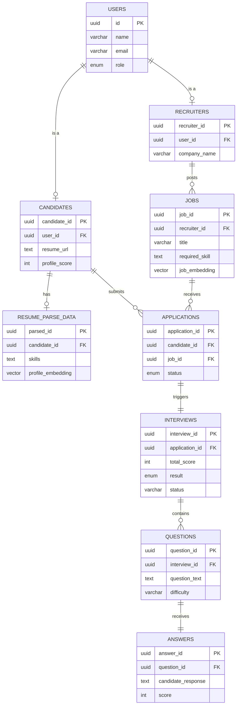

# Database Architecture & Schema

## A. Overview
The database for the AI-Based Candidate Recruitment System serves as the central hub for storing user profiles, job postings, candidate applications, and AI-driven interview assessments. 

We use **Supabase (PostgreSQL)** because of its powerful relational features, built-in vector support (`pgvector`) for AI matching, and out-of-the-box authentication integration. Supabase provides real-time capabilities and seamless integration with our React frontend and Node.js backend, allowing for secure and scalable data flow.

---

## B. Schema Design

### 1. `users`
Core table for authentication and role management.
- `id` (UUID, Primary Key) - References `auth.users.id`.
- `name` (VARCHAR) - Full name of the user.
- `email` (VARCHAR, Unique) - User's email address.
- `role` (ENUM: 'candidate', 'recruiter') - Role of the user in the platform.
- `created_at` (TIMESTAMPTZ) - Account creation timestamp.

### 2. `candidates`
Stores candidate-specific profile details.
- `candidate_id` (UUID, Primary Key)
- `user_id` (UUID, Unique, Foreign Key `users.id`)
- `resume_url` (TEXT) - Link to candidate's uploaded resume.
- `profile_score` (INT) - Overall AI-computed profile score.
- `created_at` (TIMESTAMPTZ)

### 3. `recruiters`
Stores recruiter-specific profile details.
- `recruiter_id` (UUID, Primary Key)
- `user_id` (UUID, Unique, Foreign Key `users.id`)
- `company_name` (VARCHAR) - Company the recruiter represents.
- `created_at` (TIMESTAMPTZ)

### 4. `jobs`
Job postings created by recruiters.
- `job_id` (UUID, Primary Key)
- `recruiter_id` (UUID, Foreign Key `recruiters.recruiter_id`)
- `title` (VARCHAR) - Job title.
- `description` (TEXT) - Detailed job description.
- `required_skill` (TEXT) - Expected skills (JSON or comma-separated).
- `experience_level` (VARCHAR) - Entry, Mid, Senior.
- `location` (VARCHAR) - Job location.
- `qualification` (VARCHAR) - Minimum education/qualification.
- `positions` (INT) - Number of open roles.
- `interview_difficulty` (VARCHAR) - Difficulty level for AI questions.
- `passing_threshold` (INT) - Score needed to pass the AI interview.
- `job_embedding` (VECTOR) - *[AI Module]* Embeddings for semantic matching.
- `created_at` (TIMESTAMPTZ)

### 5. `applications`
Links candidates to the jobs they applied for.
- `application_id` (UUID, Primary Key)
- `candidate_id` (UUID, Foreign Key `candidates.candidate_id`)
- `job_id` (UUID, Foreign Key `jobs.job_id`)
- `status` (ENUM: 'pending', 'interviewing', 'accepted', 'rejected') - Application progression.
- `created_at` (TIMESTAMPTZ)

### 6. `interviews`
Tracks the AI-driven interview instances per application.
- `interview_id` (UUID, Primary Key)
- `application_id` (UUID, Unique, Foreign Key `applications.application_id`)
- `interview_date` (TIMESTAMPTZ) - When the interview is scheduled/taken.
- `status` (ENUM: 'not_started', 'in_progress', 'completed', 'abandoned')
- `total_score` (INT) - Aggregated score from answers.
- `result` (ENUM: 'pass', 'fail', 'pending') - Final interview outcome.
- `current_difficulty_level` (VARCHAR) - Adaptive difficulty state.
- `created_at` (TIMESTAMPTZ)

### 7. `questions`
Dynamically generated questions for the interview.
- `question_id` (UUID, Primary Key)
- `interview_id` (UUID, Foreign Key `interviews.interview_id`)
- `sequence_number` (INT) - Ordering in the interview.
- `topic` (VARCHAR) - Subject area.
- `difficulty` (VARCHAR) - Question complexity.
- `question_text` (TEXT) - The actual prompt.
- `expected_answer_keywords` (TEXT) - Keywords the AI looks for.
- `created_at` (TIMESTAMPTZ)

### 8. `answers`
Candidate's response to the AI-generated questions.
- `answer_id` (UUID, Primary Key)
- `question_id` (UUID, Unique, Foreign Key `questions.question_id`)
- `candidate_response` (TEXT) - What the candidate answered.
- `score` (INT) - AI evaluation score for this specific answer.
- `ai_feedback` (TEXT) - AI's feedback on the candidate's response.
- `time_taken_seconds` (INT) - Time spent answering.
- `created_at` (TIMESTAMPTZ)

### 9. `resume_parse_data`
Parsed and structured data extracted from the candidate's resume.
- `parsed_id` (UUID, Primary Key)
- `candidate_id` (UUID, Unique, Foreign Key `candidates.candidate_id`)
- `skills` (TEXT) - Extracted skills.
- `education` (TEXT) - Extracted education details.
- `experience_years` (INT) - Total years of experience.
- `profile_embedding` (VECTOR) - *[AI Module]* Embeddings for resume-job similarity matching.
- `created_at` (TIMESTAMPTZ)

---

## C. Relationships

- **1-to-1 (`users` ↔ `candidates` / `recruiters`)**: A user is either exactly one Candidate or exactly one Recruiter based on their role.
- **1-to-N (`recruiters` ↔ `jobs`)**: A Recruiter can post multiple Jobs.
- **1-to-N (`candidates` ↔ `applications`)**: A Candidate can apply to multiple Jobs.
- **1-to-N (`jobs` ↔ `applications`)**: A Job can have multiple Applications.
- **1-to-1 (`applications` ↔ `interviews`)**: An Application spawns exactly one AI Interview.
- **1-to-N (`interviews` ↔ `questions`)**: An Interview consists of multiple dynamically generated Questions.
- **1-to-1 (`questions` ↔ `answers`)**: Each Question has exactly one Candidate Answer.
- **1-to-1 (`candidates` ↔ `resume_parse_data`)**: A Candidate's uploaded resume has exactly one parsed data record.

---

## D. ER Diagram

**Description:**
The schema begins with the central `users` table mapping to either `candidates` or `recruiters`. Recruiters create `jobs`. Candidates create `applications` connecting them to specific `jobs`. Once applied, an `application` triggers an `interview` pipeline. The interview encompasses multiple `questions`, each mapping 1-to-1 with candidate `answers`. Separately, candidate resumes are parsed into `resume_parse_data` for vector-based profile matching.

---

## E. Use Cases

1. **Recruiter Posts a Job:**
   - A row is inserted in `jobs` referencing their `recruiter_id`.
   - Embeddings are generated and stored in `job_embedding` for AI candidate matching.
   
2. **Candidate Applies to Job:**
   - A row is created in `applications` linking `candidate_id` and `job_id`.
   - The status defaults to `'pending'`.
   
3. **AI Interview Process Flow:**
   - Application status updates to `'interviewing'`.
   - An `interviews` record is initialized.
   - The AI generates a set of `questions` mapped to the interview.
   - The candidate submits `answers`, which the AI scores dynamically.
   - The total score aggregates in `interviews`, and the result is finalized (`'pass'` or `'fail'`).

---

## F. Future-Ready Fields (AI Integration)
- `job_embedding` (`jobs`) & `profile_embedding` (`resume_parse_data`): Uses `pgvector` to run semantic cosine-similarity searches (TF-IDF/BERT matching) so we can rank the best-fit candidates for a job instantly.
- `ai_feedback` (`answers`): To show candidates automated, constructive critique on why they missed certain marks.
- `current_difficulty_level` (`interviews`): Supports dynamic, adaptive interviewing where the GPT engine adjusts question complexity based on previous answer scores.

---

## F2. Future Enhancements
- **Logging & Audit Trail**: Introduction of an `audit_logs` table to track who modifies job statuses or interview scores.
- **Advanced Analytics**: Aggregated tables or materialized views summarizing candidate pass rates by recruiter or specific job categories.
- **Real-Time Notifications**: Extension of `applications` schema to trigger row-level Webhooks (via Supabase) pushing in-app alerts whenever interview statuses change.
- **AI Model Versioning**: Tracking the specific version of the AI model used in `answers` so scoring remains consistent during model upgrades.

---

## G. Design Decisions
- **UUIDs over Auto-Incrementing Integers**: Prevents predictable enumeration of resources (security) and scales seamlessly across distributed systems.
- **Supabase & Postgres**: Selected for native Row Level Security (RLS), real-time capabilities, and `pgvector` for our upcoming ML/AI pipeline.
- **Strict Normalization (1NF - 3NF)**: Prevents data anomalies. `questions` and `answers` are decoupled to ensure scoring logic and question generation can happen asynchronously without locking table rows.

---

## H. Update Rules

> **IMPORTANT: Auto-Update Mechanism**
> Whenever a new table, column, or relationship is added to the Supabase database:
> 1. Update the **Schema Design** section to define the new data types.
> 2. Document any new relationships in the **Relationships** list.
> 3. Adjust the **ER Diagram** to accurately reflect the data flow.
> 4. Ensure that FYP mentors or new contributors can understand the change by adding relevant context to the **Use Cases** or **Design Decisions**.
> 
> *Do not consider a database migration complete until this file is fully updated.*
