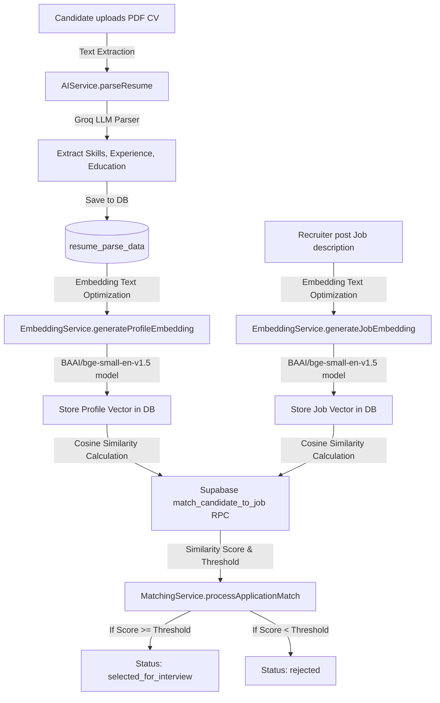

> [!WARNING]
> **DYNAMIC RULE FILE**: Do not edit this file directly. This file is automatically synchronized with active backend class structures and JSDoc parameters by the sync script: `scripts/syncDocs.cjs`. Any changes made here will be overwritten on the next project modification.

# 🧠 CV-Job Matching & Parsing Engine

Welcome to the **CV-Job Matching and Parsing** system of the Xenon AI Recruitment Platform. This system coordinates semantic analysis, content hashing, vector embeddings, and mathematical similarity computations to connect candidates with appropriate jobs.

---

## 🛠️ Architecture & Flow

The system employs a multi-step semantic parsing and matching flow designed to minimize overhead and maximize match accuracy.

---

## 🚀 Key Features

1. **AI-Powered Resume Parsing**: Uses Groq LLM to analyze raw CV text and extract structured JSON (skills list, education hierarchy, experience years).
2. **Standardized Embedding Space**: Utilizes HuggingFace Inference API to generate 384-dimensional vector embeddings using the **`BAAI/bge-small-en-v1.5`** model.
3. **Content Hashing Cache**: Automatically computes MD5 hashes of normalized text to prevent redundant API calls when profile/job details are unchanged.
4. **Vector Distance Search**: Executes high-performance Cosine Similarity operations in-database using PostgreSQL `pgvector` extensions.

---

## 📂 Active Code API Documentation

_This section is automatically updated based on class signatures._

## 1. AIService (Parsing Core)
### 📌 `parseResume(candidateId, resumeText)`

Asynchronous resume parsing E.g., returns JSON representation of skills, education, experience

---

## 2. EmbeddingService (Vector Generation & Hashing)
### 📌 `initialize()`

Pre-warm the embedding model by loading it into RAM on server startup.

---

### 📌 `generateJobEmbedding(jobId, description)`

Generate and store an embedding for a job description. Skips regeneration if the description text hasn't changed.

**Parameters:**
- `{string} jobId       - UUID of the job`
- `{string} description - Raw job description text`

**Returns:** `{Object} { embedding, cached, hash }`

---

### 📌 `generateProfileEmbedding(candidateId, profileText)`

Generate and store an embedding for a candidate's profile/CV. Skips regeneration if the profile text hasn't changed.

**Parameters:**
- `{string} candidateId - UUID of the candidate (from candidates table)`
- `{string} profileText - Combined CV/profile text (skills + education + experience)`

**Returns:** `{Object} { embedding, cached, hash }`

---

### 📌 `buildProfileText(parseData)`

Build a combined profile text from resume_parse_data fields. This creates a unified string optimized for embedding quality.

**Parameters:**
- `{Object} parseData - Row from resume_parse_data table`

**Returns:** `{string} Combined, embedding-optimized text`

---

### 📌 `buildJobText(jobData)`

Build a combined job text from job fields. Creates a unified string optimized for embedding quality.

**Parameters:**
- `{Object} jobData - Row from jobs table`

**Returns:** `{string} Combined, embedding-optimized text`

---

### 📌 `checkEmbeddingsExist(jobId, candidateId)`

Check if both a job and candidate have valid embeddings stored.

**Parameters:**
- `{string} jobId       - UUID of the job`
- `{string} candidateId - UUID of the candidate`

**Returns:** `{Object} { jobHasEmbedding: boolean, profileHasEmbedding: boolean }`

---

### 📌 `ensureEmbeddings(jobId, candidateId)`

Ensure both embeddings exist, generating any that are missing. This is the primary entry point called during the application flow.

**Parameters:**
- `{string} jobId       - UUID of the job`
- `{string} candidateId - UUID of the candidate`

**Returns:** `{Object} { jobEmbeddingResult, profileEmbeddingResult }`

---

### 📌 `_generateEmbedding(text)`

Generate a vector embedding by calling the HuggingFace Inference API. Includes retry logic with exponential backoff for transient failures. @private

**Parameters:**
- `{string} text - Normalized text to embed`

**Returns:** `{number[]} Array of 384 floating-point numbers`

---

### 📌 `_storeJobEmbedding(jobId, embedding, textHash)`

Store a job embedding and its content hash in the jobs table. @private

---

### 📌 `_storeProfileEmbedding(candidateId, embedding, textHash)`

Store a profile embedding and its content hash in resume_parse_data. @private

---

### 📌 `_getExistingJobHash(jobId)`

Retrieve the current embedding text hash for a job. Used to determine if regeneration is needed. @private

---

### 📌 `_getExistingProfileHash(candidateId)`

Retrieve the current embedding text hash for a candidate profile. Used to determine if regeneration is needed. @private

---

### 📌 `_normalizeText(text)`

Normalize raw text before embedding generation. Ensures consistent embeddings regardless of formatting differences. Steps: 1. Lowercase 2. Collapse whitespace (newlines, tabs, multiple spaces → single space) 3. Remove special characters that don't add semantic meaning 4. Trim @private

**Parameters:**
- `{string} text - Raw input text`

**Returns:** `{string} Cleaned, normalized text`

---

### 📌 `_hashText(text)`

Generate an MD5 hash of the normalized text. Used to detect content changes without storing full text. @private

**Parameters:**
- `{string} text - Normalized text`

**Returns:** `{string} MD5 hex digest`

---

### 📌 `_sleep(ms)`

Async sleep utility for retry delays. @private

**Parameters:**
- `{number} ms - Milliseconds to wait`

**Returns:** `{Promise<void>}`

---

## 3. MatchingService (Decision & Query Engine)
### 📌 `processApplicationMatch(applicationId, candidateId, jobId)`

Process an application: ensure embeddings exist, compute similarity, evaluate against the threshold, and update the application status.

**Parameters:**
- `{string} applicationId - UUID of the application`
- `{string} candidateId   - UUID of the candidate`
- `{string} jobId         - UUID of the job`

**Returns:** `{Object} { status, matchPercentage, meetsThreshold, jobThreshold }`

---

### 📌 `findRecommendedJobs(candidateId, limit = 10)`

Find the best matching jobs for a specific candidate. Useful for a "Recommended Jobs" feature on the candidate dashboard.

**Parameters:**
- `{string} candidateId - UUID of the candidate`
- `{number} limit - Maximum number of jobs to return (default: 10)`

**Returns:** `{Array} List of matching jobs with scores`

---

### 📌 `findTopCandidatesForJob(jobId, limit = 20)`

Find the best matching candidates for a specific job. Useful for the recruiter dashboard to proactively source candidates.

**Parameters:**
- `{string} jobId - UUID of the job`
- `{number} limit - Maximum number of candidates to return (default: 20)`

**Returns:** `{Array} List of matching candidates with scores`

---

---
*Note: This documentation was dynamically synchronized with class structures on 6/25/2026, 9:19:33 AM.*
