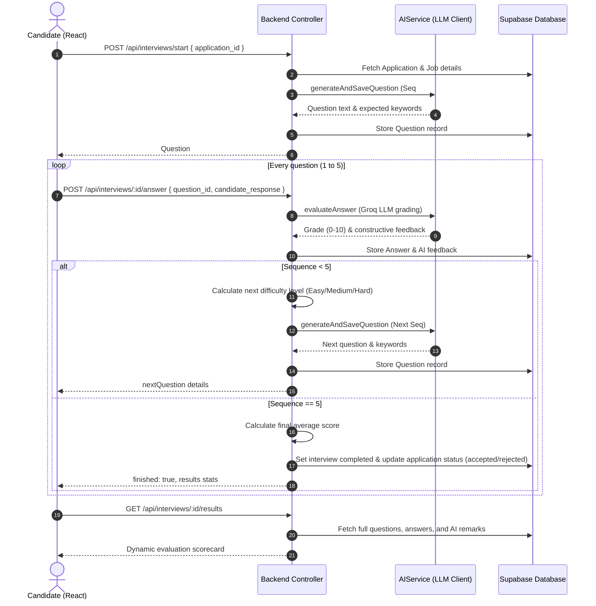

> [!WARNING]
> **DYNAMIC RULE FILE**: Do not edit this file directly. This file is automatically synchronized with active backend class structures and JSDoc parameters by the sync script: `scripts/syncDocs.cjs`. Any changes made here will be overwritten on the next project modification.

# 🎙️ Adaptive AI Interview System

Welcome to the **Adaptive AI Interview System** of the Xenon AI Recruitment Platform. This workspace hosts candidate interviews, controls timing safety, dynamically scales testing difficulty, and grades candidates using dynamic AI evaluation logic.

---

## 🛠️ System Architecture

The AI Interview system runs an interactive feedback loop between the React Client, the Node/Express backend, Groq LLM, and Supabase.

---

## 🚀 Key Features

1. **Immersive Distraction-Free UX**: Hides all navigation overlays and standard sidebar layouts during active testing. Provides a center-aligned Typeform-like focus interface.
2. **Secure Token Authorization**: Verifies candidates against public/private row ownership using Supabase session JWT tokens in REST headers.
3. **Adaptive Difficulty Adjustment**: Scales question difficulty (Easy ↔ Medium ↔ Hard) dynamically based on the performance of the candidate's prior answer.
4. **Countdown Safety Hook**: Restricts questions to 300 seconds (5 minutes) per query, utilizing ref-bound handlers to prevent closure loss during auto-submission.
5. **Interactive Scorecard**: Renders beautiful radial gradients matching overall candidate score and detailed accordions containing personalized expert AI evaluations.

---

## 📂 Active Code API Documentation

_This section is automatically updated based on class signatures._

## 1. InterviewController (Routing Handlers)
### 📌 `startInterview(req, res, next)`

POST /api/interviews/start Start a new interview for a given application. Body: { application_id: UUID } Auth: Requires candidate role

---

### 📌 `submitAnswer(req, res, next)`

POST /api/interviews/:interviewId/answer Submit an answer to the current question, evaluate it, and generate the next question. Params: interviewId Body: { question_id, candidate_response, time_taken_seconds }

---

### 📌 `getInterviewResults(req, res, next)`

GET /api/interviews/:interviewId/results Get final score, details and full question/answer list of the interview.

---

### 📌 `getMyInterviews(req, res, next)`

GET /api/interviews/my-interviews Candidate lists their interviews.

---

## 2. AIService (Adaptive Prompt Generator)
### 📌 `getNextQuestion(jobTitle, currentDifficulty, topic)`

Generate the next interview question

---

### 📌 `evaluateAnswer(questionText, candidateAnswer, expectedKeywords)`

Parse and score a candidate's answer

---

---
*Note: This documentation was dynamically synchronized with class structures on 6/25/2026, 9:19:33 AM.*
