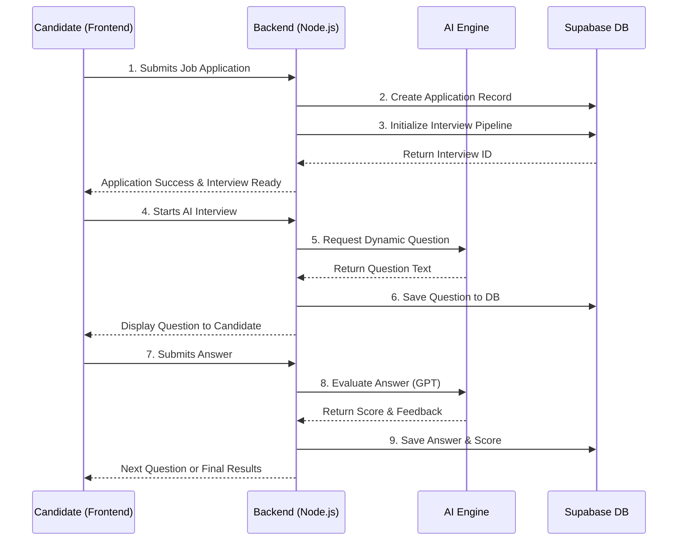

# System Design & Architecture

## A. High-Level Architecture
The AI-Based Candidate Recruitment System follows a modern, scalable **Three-Tier Architecture** coupled with external AI service integrations. This decouples the user interface, business logic, and data layers, ensuring the system remains maintainable as new AI modules are introduced.

```mermaid
flowchart TD
    subgraph Client [Frontend Layer]
        UI[React Application]
    end

    subgraph API [Backend Layer]
        Node[Node.js / Express Server]
    end

    subgraph Data [Data & Auth Layer]
        Supa[Supabase PostgreSQL & Auth]
    end
    
    subgraph AI [AI Processing Layer (Planned)]
        Match[Resume-Job Matching Engine]
        GPT[GPT Interview Module]
    end

    UI <-->|REST API JSON| Node
    UI <-->|Direct Auth| Supa
    Node <-->|pg/Supabase Client| Supa
    Node <-->|API Calls| AI
```

---

## B. Component Breakdown

### 1. Frontend (React)
- **Responsibility**: Handles user interaction, state management, and view rendering.
- **Key Features**: 
  - Role-based dynamic dashboards for Candidates and Recruiters.
  - Interactive job application and interview UI.
  - Direct integration with Supabase Auth for immediate JWT retrieval.

### 2. Backend (Node.js / Express)
- **Responsibility**: Acts as the central orchestrator for business logic, data validation, and secure communication with the database.
- **Key Features**:
  - Exposes RESTful endpoints for CRUD operations (Jobs, Applications).
  - Validates request payloads and enforces role-based access control (RBAC).
  - Handles secure orchestration between the frontend, the database, and third-party AI models.

### 3. Database & Auth (Supabase)
- **Responsibility**: Manages persistent storage, user identity, and vector embeddings.
- **Key Features**:
  - PostgreSQL relational structure.
  - `pgvector` for AI-based semantic searches.
  - Built-in JWT verification and user session management.

### 4. AI Modules (Planned)
- **Matching Engine (TF-IDF / Embeddings)**: Compares parsed resume vectors against job description vectors to generate a `profile_score`.
- **GPT-Based Interviewer**: Dynamically selects questions from the database, evaluates candidate responses via prompt engineering, and returns a calculated `score` and `ai_feedback`.

---

## C. Data Flow Diagram

### End-to-End Application & Interview Flow


---

## D. Modular Design Explanation
The system uses a strictly modular approach, primarily seen in the backend structure (`controllers/`, `services/`, `routes/`, `middlewares/`). 
- **Modularity**: Each domain (e.g., Auth, Jobs, Interviews) has its own encapsulated logic. The Job controller does not handle Interview logic.
- **Interchangeability**: The AI matching engine and GPT modules will be abstracted behind interface-like services. This means we can swap out GPT-4 for an open-source LLM later without rewriting the core application flow.

---

## E. Separation of Concerns
1. **Routing Layer**: Solely responsible for mapping HTTP requests to controller functions. Contains no business logic.
2. **Controller Layer**: Extracts request data (`req.body`, `req.params`), calls the appropriate Service, and formats the HTTP response (`res.status`).
3. **Service Layer**: Contains the core business rules. It is the *only* layer that interacts with the AI services or constructs complex database queries.
4. **Data Access Layer**: Supabase SDK calls are abstracted here to keep the service layer clean of direct ORM/SQL syntax where possible.

---

## F. Update Rules

> **IMPORTANT: Auto-Update Mechanism**
> Whenever the architecture changes (e.g., adding a microservice, changing the frontend framework, integrating a new external API):
> 1. Update the **High-Level Architecture** diagram to visually represent the new node.
> 2. Add the new component to the **Component Breakdown** section.
> 3. If a core process changes (like how authentication or interviewing works), update the **Data Flow Diagram** sequence.
> 
> *Maintain this file as the ultimate source of truth for the project's structural integrity.*
