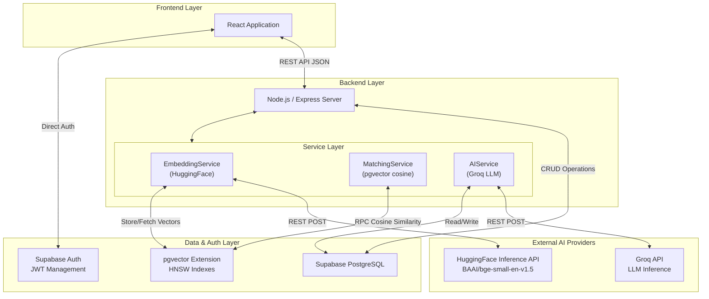
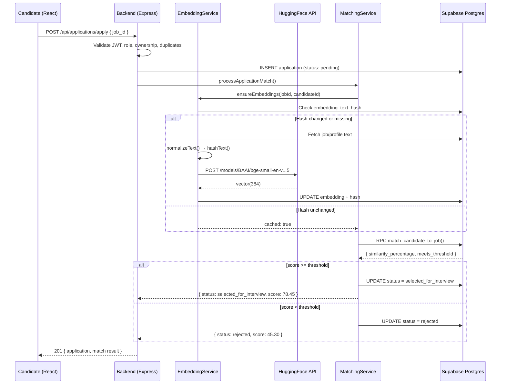
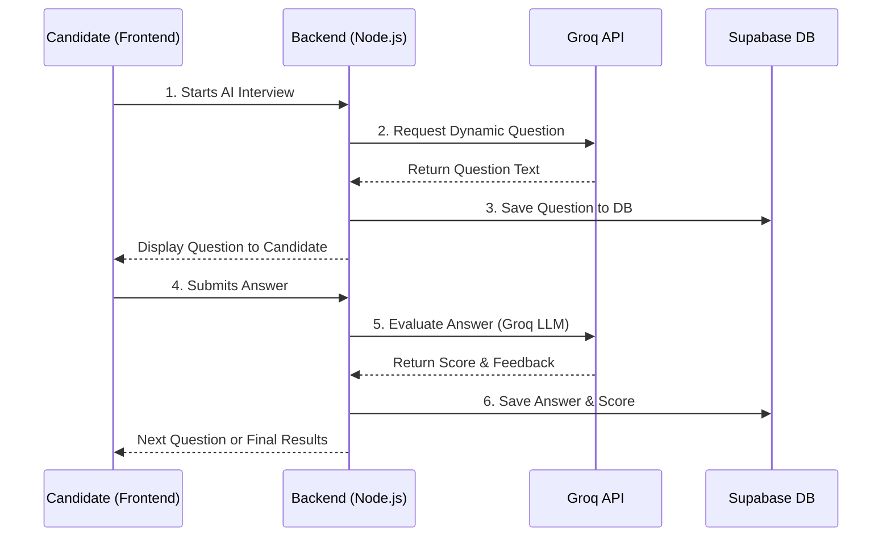

# System Design & Architecture

## A. High-Level Architecture
The AI-Based Candidate Recruitment System follows a modern, scalable **Three-Tier Architecture** with integrated AI service modules. This decouples the user interface, business logic, and data layers, while the AI modules are encapsulated within the service layer for maximum modularity.

---

## B. Component Breakdown

### 1. Frontend (React)
- **Responsibility**: Handles user interaction, state management, and view rendering.
- **Key Features**: 
  - Role-based dynamic dashboards for Candidates and Recruiters.
  - Interactive job application and interview UI.
  - Direct integration with Supabase Auth for immediate JWT retrieval.
  - Displays AI match scores and recommendation rankings.

### 2. Backend (Node.js / Express)
- **Responsibility**: Acts as the central orchestrator for business logic, data validation, AI processing, and secure communication with the database.
- **Key Features**:
  - Exposes RESTful endpoints for CRUD operations (Jobs, Applications).
  - Validates request payloads and enforces role-based access control (RBAC).
  - Handles secure orchestration between the frontend, the database, and AI providers.
  - Manages the AI matching pipeline (embedding generation → similarity computation → threshold evaluation).

### 3. Database & Auth (Supabase)
- **Responsibility**: Manages persistent storage, user identity, and vector similarity operations.
- **Key Features**:
  - PostgreSQL relational structure with 9 tables.
  - `pgvector` extension with HNSW indexes for fast cosine similarity search.
  - Stored SQL functions (`match_candidate_to_job`, `find_matching_jobs`, `find_matching_candidates`) that execute vector math directly in the database.
  - Built-in JWT verification and user session management.

### 4. AI Modules (Implemented)

#### 4a. Embedding Service (HuggingFace)
- **Model**: `BAAI/bge-small-en-v1.5` (384 dimensions)
- **Provider**: HuggingFace Inference API (free tier)
- **Purpose**: Converts job descriptions and candidate CVs into dense vector representations for semantic comparison.
- **Key Design**:
  - Content-hash deduplication (MD5) to avoid redundant API calls
  - Retry logic with exponential backoff for rate limits and cold starts
  - Text normalization pipeline for consistent embeddings

#### 4b. Matching Engine (pgvector)
- **Algorithm**: Cosine similarity via pgvector's `<=>` operator
- **Index**: HNSW (Hierarchical Navigable Small World) for sub-linear search
- **Purpose**: Computes the semantic similarity between a candidate profile and a job description, evaluates against the recruiter's threshold, and automatically updates the application status.

#### 4c. Interview AI (Groq)
- **Provider**: Groq API (LLM inference)
- **Purpose**: Dynamically generates interview questions and evaluates candidate responses via prompt engineering.
- **Note**: Groq provides only LLM inference, NOT embeddings. HuggingFace is used for all embedding operations.

---

## C. Data Flow Diagrams

### AI Matching Pipeline (Candidate Applies to Job)

### Interview Pipeline (After Selection)

---

## D. Modular Design Explanation
The system uses a strictly modular approach, primarily seen in the backend structure (`controllers/`, `services/`, `routes/`, `middlewares/`). 

- **Modularity**: Each domain (Auth, Jobs, Applications, Embeddings, Matching, Interviews) has its own encapsulated logic. The Application controller does not handle Embedding generation directly — it delegates to the service layer.
- **Interchangeability**: The AI modules are abstracted behind service classes:
  - `EmbeddingService` can switch from HuggingFace to OpenAI or a local model by changing only the API call inside `_generateEmbedding()`.
  - `MatchingService` is provider-agnostic — it only consumes vectors stored in the database.
  - `AIService` can swap Groq for any OpenAI-compatible LLM by updating `llmClient.js`.

---

## E. Separation of Concerns

| Layer | Responsibility | Example |
|-------|---------------|---------|
| **Routing** | Maps HTTP requests to controller functions. Contains no business logic. | `router.post('/apply', verifyAuth, requireRole('candidate'), aiLimiter, controller.applyToJob)` |
| **Controller** | Extracts request data, validates inputs, calls services, formats HTTP response. | `ApplicationController.applyToJob()` — validates, creates app, calls `MatchingService`, returns result |
| **Service** | Contains core business rules. Only layer that interacts with AI providers and constructs complex DB queries. | `MatchingService.processApplicationMatch()` — orchestrates embeddings, similarity, threshold, status update |
| **Data Access** | Supabase SDK calls and pgvector RPC functions. | `supabaseAdmin.rpc('match_candidate_to_job', ...)` |

---

## F. Threshold Logic

The system uses a **two-tier threshold** model:

| Threshold | Table | Purpose | Set By |
|-----------|-------|---------|--------|
| `similarity_threshold` | `jobs` | Minimum cosine similarity % for AI pre-screening | Recruiter (during job creation) |
| `passing_threshold` | `jobs` | Minimum interview score to pass the AI interview | Recruiter (during job creation) |

**Decision Flow:**
1. **Pre-screening (AI Matching)**: `match_score >= similarity_threshold` → `selected_for_interview`
2. **Interview Phase**: `total_score >= passing_threshold` → `pass` / `accepted`

This two-tier approach ensures candidates are first filtered by profile relevance, then evaluated on actual skill demonstration.

---

## G. Performance Optimizations

| Optimization | Implementation |
|-------------|---------------|
| **Embedding Deduplication** | MD5 content hash prevents redundant HuggingFace API calls when text unchanged |
| **HNSW Indexes** | Sub-linear vector search on both `job_embedding` and `profile_embedding` |
| **Pre-generated Embeddings** | Embeddings generated when jobs are created/updated, not during application |
| **Cached Vectors** | During application, stored embeddings are reused — no API call needed |
| **Sequential Batch Processing** | Batch re-matching processes applications one-by-one to respect rate limits |
| **Rate Limiting** | AI endpoints limited to 10 req/15min to protect HuggingFace free tier |

---

## H. Update Rules

> **IMPORTANT: Auto-Update Mechanism**
> Whenever the architecture changes (e.g., adding a microservice, changing the frontend framework, integrating a new external API):
> 1. Update the **High-Level Architecture** diagram to visually represent the new node.
> 2. Add the new component to the **Component Breakdown** section.
> 3. If a core process changes (like how authentication, matching, or interviewing works), update the **Data Flow Diagram** sequence.
> 4. If a new AI provider is introduced, document it in the **AI Modules** section with model name, dimensions, and provider.
> 
> *Maintain this file as the ultimate source of truth for the project's structural integrity.*
