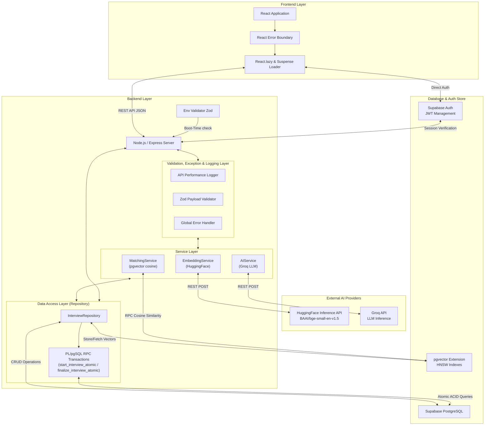
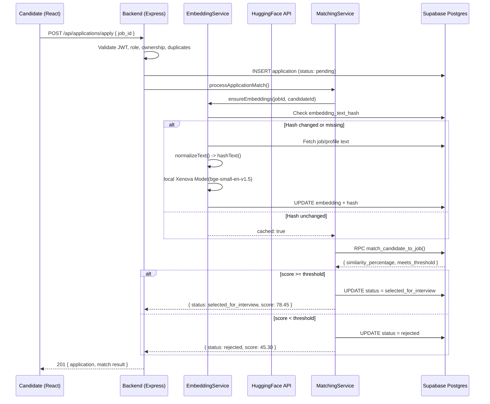
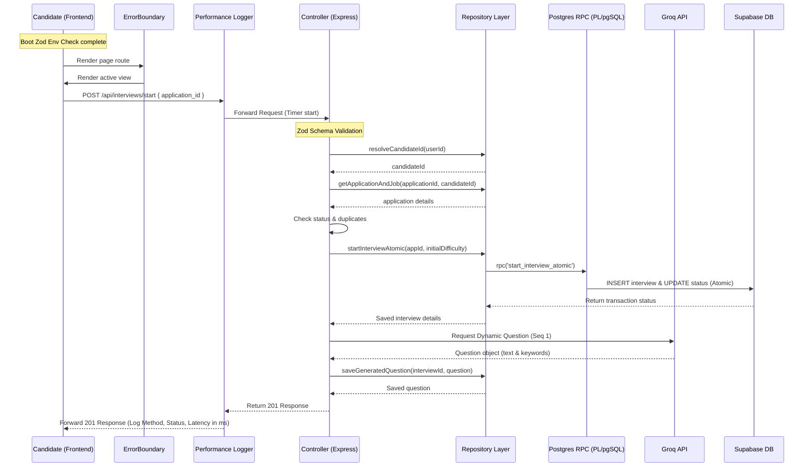

# System Design & Architecture

## A. High-Level Architecture
The AI-Based Candidate Recruitment System follows a modern, scalable **Three-Tier Architecture** with integrated AI service modules. This decouples the user interface, business logic, and data layers. In this refactored structure, a dedicated **Repository Layer** abstracts all direct database interactions, keeping controllers highly modular.

---

## B. Component Breakdown

### 1. Frontend (React with Vite)
- **Responsibility**: Handles user interaction, state management, and view rendering.
- **Key Features**: 
  - Role-based dynamic dashboards for Candidates and Recruiters.
  - Interactive job application and interview UI.
  - **Dynamic Route Code-Splitting**: Pages are lazy-loaded via `React.lazy` and wrapped in a premium dark-mode, glassmorphic loading screen utilizing dynamic conic-spin animations to minimize initial bundle sizes.
  - **Resilient React Error Boundary**: Integrates custom Error Boundary wrappers targeting route failure chunks (caused by patchy networks or sudden disconnections) and client crashes, providing high-quality visual fallbacks and immediate reload recovery prompts.

### 2. Backend Layer (Express)
- **Responsibility**: Orchestrates API workflows, validates configurations, records audits, sanitizes request parameters, and handles runtime failures.
- **Key Features**:
  - **Boot-Time Environment Variable Validator**: Restricts boot-up sequences using a declarative Zod env schema to check type-safety and formatting on all critical API keys and URLs, outputting clear, detailed errors and exit codes on missing fields.
  - **Custom performance-hrtime Request Logger**: Seamlessly intercepts Express requests to track performance down to microsecond decimals via `process.hrtime`, logging styled status codes in terminal.
  - **Zod Declarative Validation**: Intercepts payloads at the route layer, protecting logic from invalid or malformed data schemas.
  - **Global Error Handling**: Express middleware intercepts all thrown operational errors (`BadRequestError`, `ForbiddenError`, `NotFoundError`), responding to the client with unified, standard structures.

### 3. Repository Layer (Data Access Isolation)
- **Responsibility**: Encapsulates all query commands, mutations, stored procedure executions, and Supabase database interactions.
- **Key Features**:
  - Exposes 16 clean repository methods to the controller layer.
  - **PL/pgSQL Stored Procedure RPC Transactions**: Moves sequential client-side database awaits into secure, single Postgres transactional SQL procedures (`start_interview_atomic`, `finalize_interview_atomic`), safeguarding ACID guarantees.
  - Completely separates direct SQL/Supabase operations from REST controllers.

### 4. AI Service Layer
- **Embedding Service**: Generates dense 384-dimensional vector embeddings locally using `@xenova/transformers` (`Xenova/bge-small-en-v1.5`), eliminating API latency. Implements content-hashing (MD5) to avoid redundant CPU operations, and is pre-warmed on server boot.
- **Matching Engine**: Coordinates cosine similarity via Postgres pgvector operators, automatically updating application workflow flags.
- **Interview AI (Groq API)**: Orchestrates adaptive question prompts and parses technical feedback scores using fast LLM inference engines, backed by offline deterministic algorithms during outages.

---

## C. Data Flow Diagrams

### AI Matching Pipeline (Candidate Applies to Job)

### Dynamic Interview Pipeline (With Repository, Atomic RPCs, and Error Boundary)

---

## D. Separation of Concerns

| Layer | Responsibility | Example |
|-------|---------------|---------|
| **Routing** | Directs HTTP traffic. Chains Zod validation and Auth middlewares. | `router.post('/start', verifyAuth, requireRole('candidate'), validate(startInterviewSchema), controller.startInterview)` |
| **Middlewares** | Validates payloads, handles authentication tokens, and formats global errors. | `validate(schema)` parses input bodies; `globalErrorHandler` catches thrown custom exceptions. |
| **Controller** | Processes endpoints, delegates queries to repositories, coordinates services, returns responses. | `InterviewController.startInterview()` — slim methods without try/catch boilerplate. |
| **Repository** | Pure database CRUD execution. Communicates directly with Supabase Postgres. | `InterviewRepository.createInterview(appId, initialDifficulty)` |
| **Service** | Handles business logic (Hashing, prompt-formatting, external LLM calls). | `AIService.getNextQuestion(title, difficulty, topic)` |

---

## E. Performance Optimizations

| Optimization | Implementation |
|-------------|---------------|
| **Vite Code Splitting** | `React.lazy()` dynamically compiles route chunks to avoid rendering heavy initial bundles. |
| **Glassmorphic Suspense** | Sleek animated spinners themed to Xenon's dark mode aesthetics run during dynamic route transitions. |
| **React Error Boundary** | Catches dynamic asset loading failures and renders a premium recovery window. |
| **Zod Boot Env Validator** | Ensures no missing configs or invalid API credentials trigger cryptic server failures. |
| **hrtime Performance Logger** | In-house microsecond request audit tracker mapping request pipeline latency. |
| **Atomic SQL Transactions** | Encapsulates sequential mutations inside PG pl/pgsql functions to guarantee database consistency. |
| **Embedding Deduplication & Pre-warming** | MD5 content hashing combined with boot-time pre-warming guarantees 0 API latency and saves CPU cycles. |
| **HNSW Indexes** | Sub-linear vector search on both `job_embedding` and `profile_embedding` using HNSW graphs. |
| **Pre-generated Embeddings** | Embeddings generated when jobs are created/updated, not during application. |
| **Cached Vectors** | During application, stored embeddings are reused — no API call needed. |

---

## F. Update Rules

> **IMPORTANT: Auto-Update Mechanism**
> Whenever the architecture changes:
> 1. Update the **High-Level Architecture** diagram to visually represent the new node.
> 2. Document the new layer under the **Separation of Concerns** matrix.
> 3. Add any new data caching or load optimization techniques to Section E.
